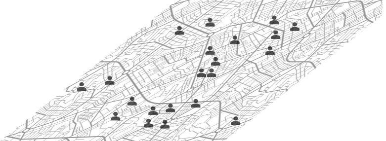
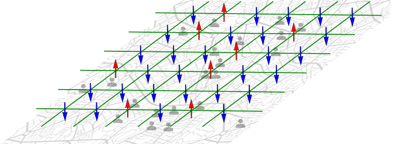
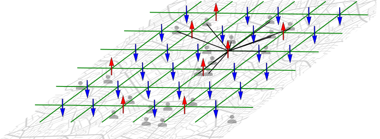
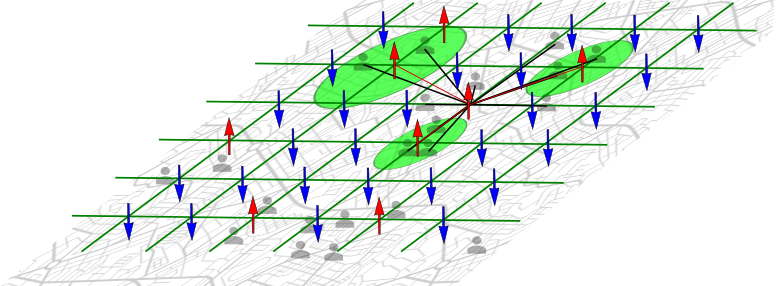

# Facility Location Problem for ATMs

## Overview
This project focuses on optimizing the placement of ATMs to maximize accessibility for clients distributed throughout the city. It should minimize the total cost consisting of constant cost per ATM, and an ATM-distance-dependent cost of client leaving, adjusted by the client's value. Various quantum, hybrid, and classical approaches are used. This problem is a special case of the Facility Location Problem. The problem is formulated as a Quadratic Unconstrained Binary Optimization (QUBO) and solved using different solvers like ExactSolver, SimulatedAnnealing (simulated annealing), DWaveSampler (quantum annealing), CQM (hybrid quantum-classical solver), and QAOA. Additionally, the same problem is solved by using conventional classical solvers from Gurobi.

## QUBO Formulation
The core of the problem is to model the Facility Location Problem as a QUBO. The resulting QUBO matrix can then be used as an input to any of the quantum or classical algorithms previously mentioned (aside from the the Gurobi solver). This model should take into account the underlying restrictions of the hardware used. Most importantly, it should take into account the limited and local connectivity of the qubits. Thus, the natural mapping between the qubit grid and the city location, as well as the k-nearest-neighbour interaction between the qubits (ATMs) is utilized. 

The problem is formulated as follows: 
1. N clients are located in a city, each client having a certain monetary value for the bank. For this case, all variables were randomly generated, with the values of clients distributed normally


2. A square grid of spins is assigned. These are the possible locations of the ATMs. The convention of spin up = acitve ATM, spin down = vacant spot is assumed.


3. The diagonal elements h<sub>ii</sub> - the 'site attractiveness' - of the QUBO matrix is calculated as a function of all distaces of the clients within a given radius, adjusted for their value.


4. The off-diagonal elements h<sub>ij</sub> - the 'repulsion interaction' - of the QUBO matrix are calcualted as a function of the distance to other ATMs, within a given radius


## The metric 

The solution is measured with a custom metric based on the distance to the closest ATM for each client adjusted by his value, and the cost of the ATMs - see the code for details. 

## Results


## Features
 - Random Position Assignment: Assigns random geographic positions to ATMs and clients.
 - Profit Calculation: Assigns profits to clients based on a normal distribution.
 - QUBO Matrix Construction: Constructs a QUBO matrix for optimization.
 - Distance Calculations: Computes Euclidean distances between ATMs and clients.
 - Solver Implementations: Implements several solvers to find the optimal placement of ATMs.
 - Plotting: Visualizes the distribution of ATMs and clients, and the optimal ATM locations.

## Usage
Function: FacilityLocation
Parameters:  

- **n_atms**: Number of ATMs  
- **n_clients**: Number of clients  
- **radio_clients**: Radius of client influence  
- **radio_atms**: Radius of ATM influence  
- **solver**: Solver type (ExactSolver, SimulatedAnnealing, DWaveSampler, CQM, QAOA)  
- **lambda1**: Constraint strength parameter 1  
- **lambda2**: Constraint strength parameter 2  
- **p**: Parameter for QAOA (default is 1)  

### Returns:

- **distances_clients_atms**: List of distances between each client and each ATM  
- **distances_atms_atms**: List of distances between each pair of ATMs  
- **solution_details**: Detailed solution information (varies by solver)  
- **optimal_atm_locations**: Optimal locations for ATMs based on the solution  
- **profits**: Profits associated with each client  

## Running the Function
Example:

```python
result = FacilityLocation(19, 1000, 0.20, 0.7, 'ExactSolver', 1, 5)